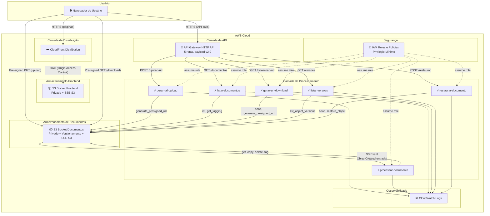
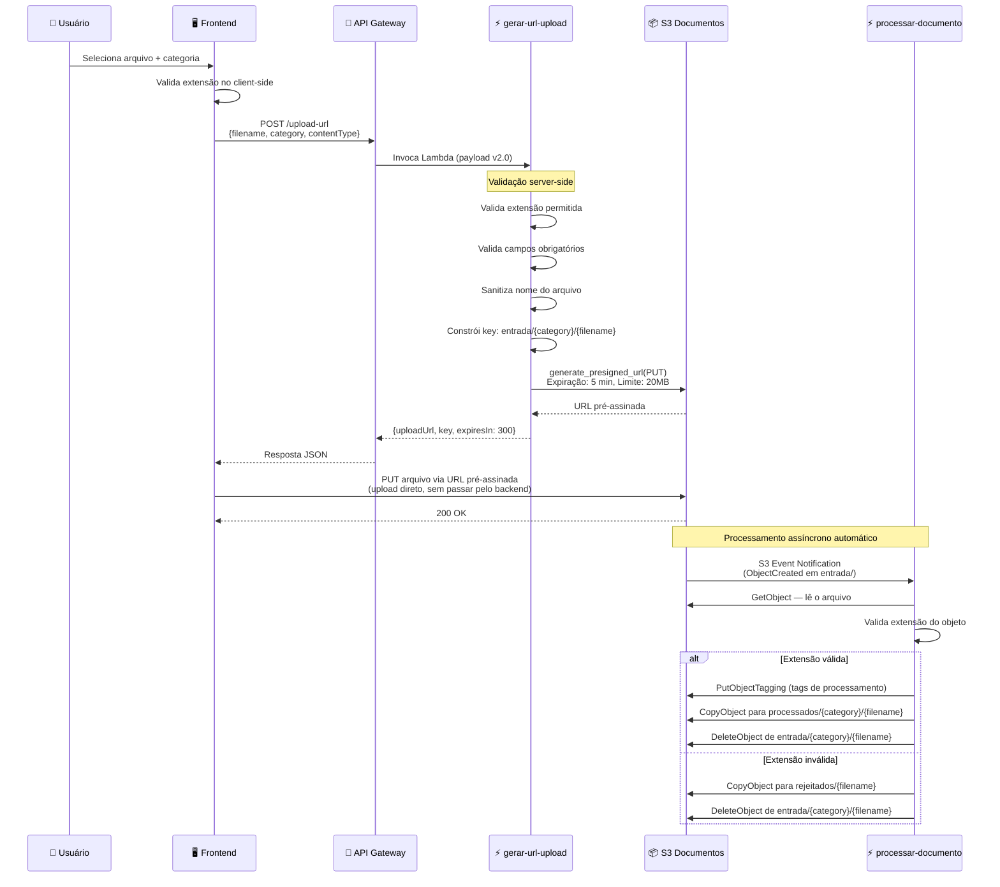
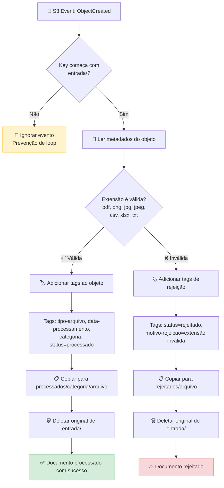
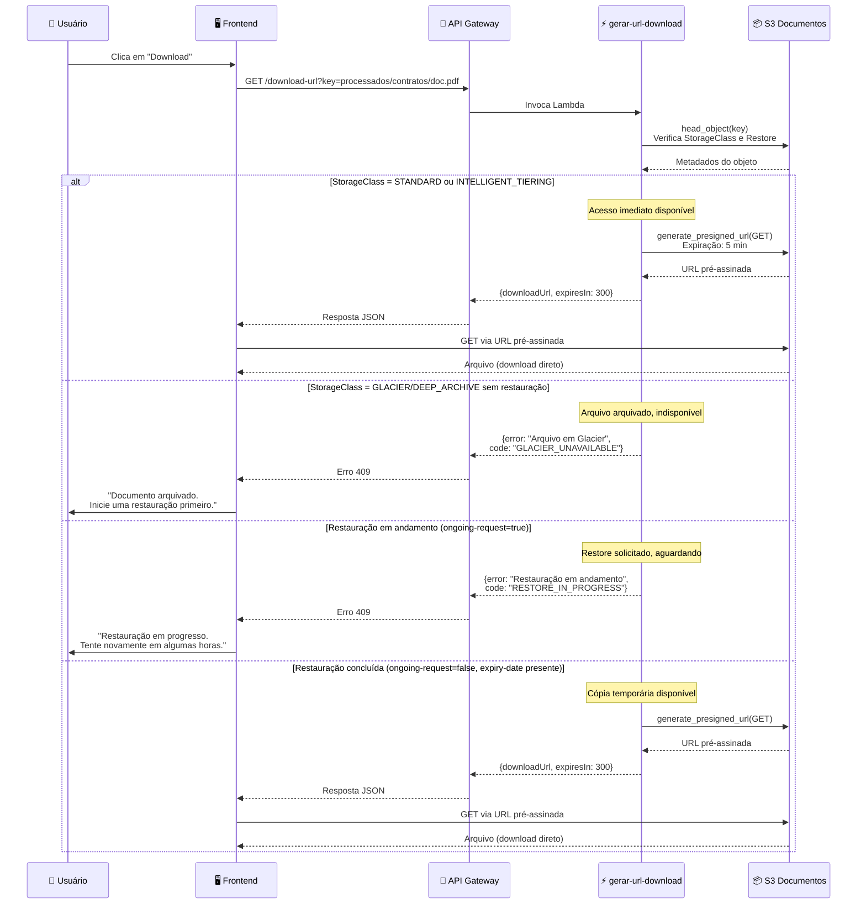
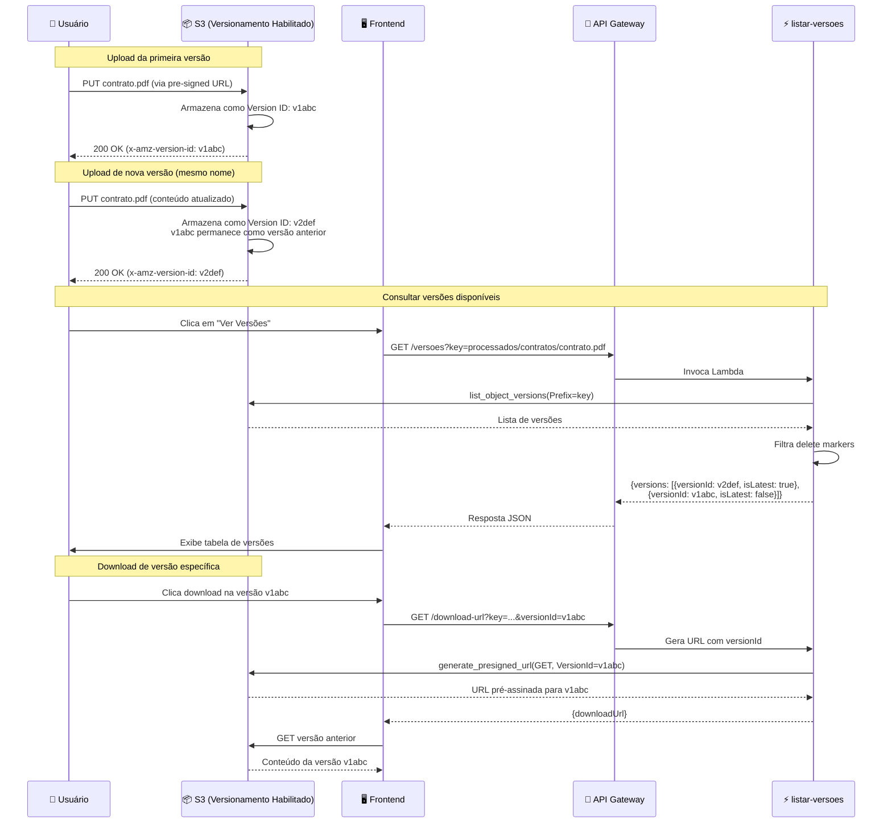
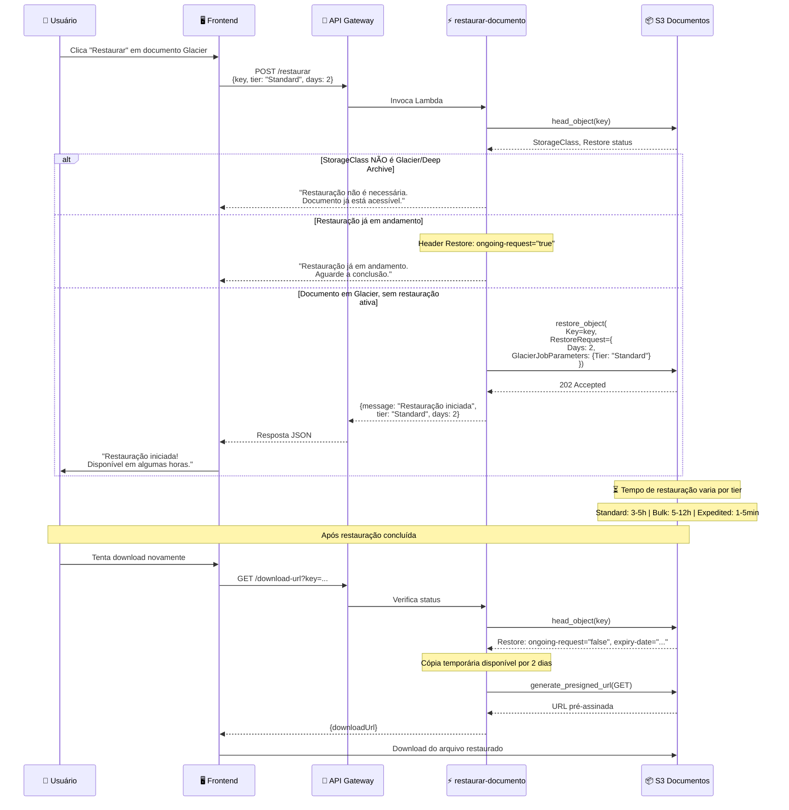
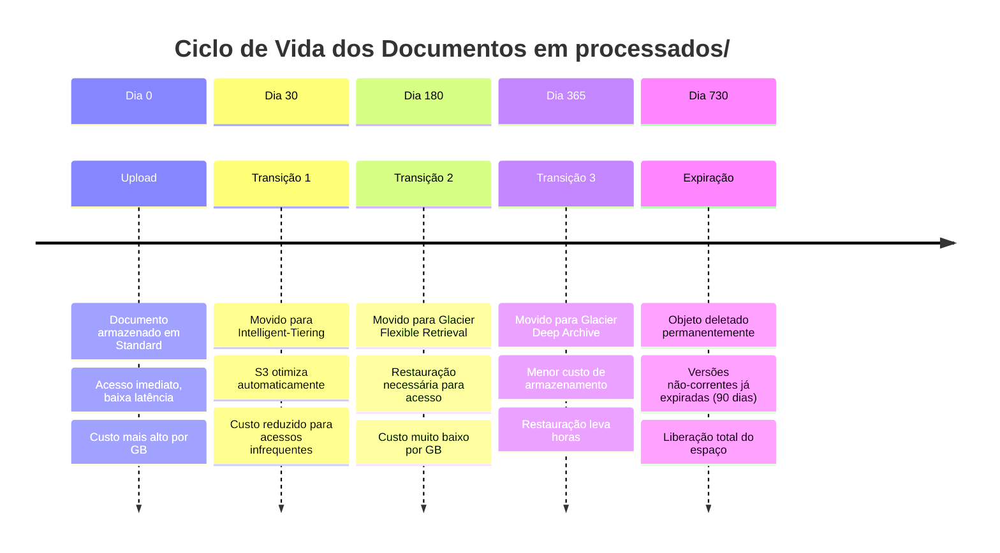
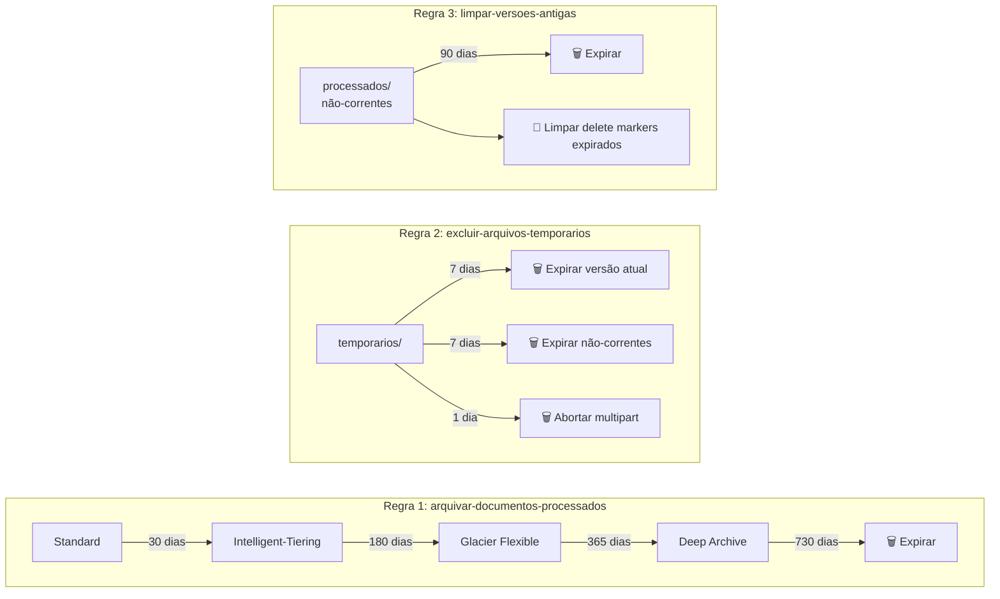
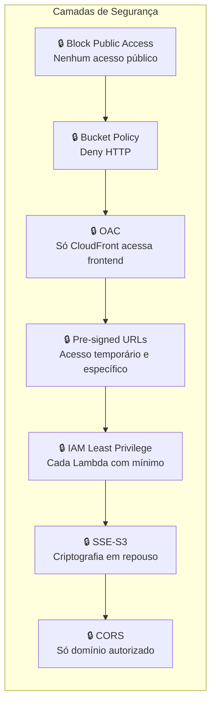

# Arquitetura — Cofre Digital de Documentos com Amazon S3

Este documento detalha a arquitetura do Cofre Digital, incluindo diagramas de infraestrutura, fluxos de dados, decisões de segurança e explicação de cada componente AWS utilizado.

> **Nota:** Toda a infraestrutura é criada manualmente via Console AWS. Este documento serve como referência visual e conceitual para entender como os serviços se conectam.

---

## 1. Diagrama Geral da Infraestrutura



---

## 2. Diagrama de Upload

O upload utiliza URLs pré-assinadas para que o arquivo vá diretamente do navegador para o S3, sem trafegar pelo Lambda ou API Gateway. Isso reduz custos e latência.



---

## 3. Diagrama de Processamento

O Lambda `processar-documento` é invocado automaticamente quando um objeto é criado no prefixo `entrada/`. Ele classifica e roteia o documento.



### Prevenção de Loop

O diagrama acima mostra a **guard clause** que impede processamento infinito:

1. O S3 Event Notification já filtra por prefixo `entrada/` (primeira barreira)
2. O Lambda verifica novamente se a key começa com `entrada/` (defesa em profundidade)
3. Objetos em `processados/`, `rejeitados/`, `temporarios/` ou `laboratorio/` são ignorados

---

## 4. Diagrama de Download

O download verifica a classe de armazenamento antes de gerar a URL. Objetos em Glacier não podem ser baixados diretamente.



---

## 5. Diagrama de Versionamento

O S3 mantém todas as versões de um objeto quando o versionamento está habilitado. Isso permite recuperar versões anteriores.



### Como o Versionamento Funciona no S3

| Conceito | Descrição |
|----------|-----------|
| **Version ID** | Identificador único gerado pelo S3 para cada versão de um objeto |
| **Versão atual** | A versão mais recente do objeto (retornada por GET sem versionId) |
| **Versão não-corrente** | Versões anteriores que ainda existem no bucket |
| **Delete Marker** | Marcador inserido ao "deletar" um objeto versionado (não apaga versões) |
| **Lifecycle** | Versões não-correntes podem ser expiradas automaticamente (ex: após 90 dias) |

---

## 6. Diagrama de Restauração Glacier

Objetos em classes Glacier não podem ser acessados diretamente. É necessário iniciar um processo de restauração que pode levar horas ou dias.



### Tiers de Restauração

| Tier | Tempo de Recuperação | Custo | Caso de Uso |
|------|---------------------|-------|-------------|
| **Expedited** | 1–5 minutos | Alto | Urgências |
| **Standard** | 3–5 horas | Médio | Uso regular |
| **Bulk** | 5–12 horas | Baixo | Restaurações em lote |

> **Nota:** Expedited não está disponível para Deep Archive. A restauração deixa o objeto disponível temporariamente (padrão: 2 dias) sem alterar sua classe de armazenamento.

---

## 7. Diagrama de Lifecycle (Ciclo de Vida)

As regras de ciclo de vida automatizam a transição de objetos entre classes de armazenamento e sua expiração, otimizando custos.



### Regras Configuradas no Bucket



| Regra | Prefixo | Ação | Dias |
|-------|---------|------|------|
| arquivar-documentos-processados | processados/ | Standard → IT | 30 |
| arquivar-documentos-processados | processados/ | IT → Glacier Flexible | 180 |
| arquivar-documentos-processados | processados/ | Glacier → Deep Archive | 365 |
| arquivar-documentos-processados | processados/ | Expirar objeto | 730 |
| excluir-arquivos-temporarios | temporarios/ | Expirar corrente | 7 |
| excluir-arquivos-temporarios | temporarios/ | Expirar não-corrente | 7 |
| excluir-arquivos-temporarios | temporarios/ | Abortar multipart | 1 |
| limpar-versoes-antigas | processados/ | Expirar não-correntes | 90 |
| limpar-versoes-antigas | processados/ | Limpar delete markers | — |

---

## 8. Explicação de Cada Componente

### 8.1 CloudFront + OAC (Origin Access Control)

**O que é:** CloudFront é a CDN (Content Delivery Network) da AWS. OAC é o mecanismo que permite ao CloudFront acessar buckets S3 privados sem torná-los públicos.

**Papel na arquitetura:**
- Serve o frontend estático (HTML, CSS, JS) globalmente com baixa latência
- É o único ponto de acesso ao Bucket Frontend (o bucket não aceita acesso direto)
- Redireciona HTTP para HTTPS automaticamente
- Faz cache dos arquivos estáticos para reduzir custos e latência

**Configuração principal:**
- Origin: Bucket Frontend com OAC
- Default Root Object: `index.html`
- Viewer Protocol Policy: Redirect HTTP to HTTPS
- Cache Policy: CachingOptimized

**Por que OAC e não OAI (Origin Access Identity)?**
OAC é a recomendação atual da AWS, substituindo OAI. Oferece suporte a SSE-KMS, funciona com todos os tipos de bucket e segue o modelo de permissões baseado em resource policy.

---

### 8.2 S3 Bucket Frontend

**O que é:** Bucket S3 dedicado a hospedar os arquivos estáticos da aplicação web.

**Papel na arquitetura:**
- Armazena `index.html`, `styles.css`, `app.js` e `config.js`
- Acesso exclusivamente via CloudFront (OAC)
- Nunca exposto diretamente à internet

**Configuração:**
| Propriedade | Valor |
|-------------|-------|
| Acesso público | ❌ Bloqueado (Block All Public Access) |
| Criptografia | SSE-S3 (AES-256) |
| Versionamento | Não necessário |
| Static Hosting | Desabilitado (CloudFront usa OAC, não website endpoint) |
| Bucket Policy | Permite apenas `s3:GetObject` do CloudFront via OAC |

---

### 8.3 S3 Bucket Documentos

**O que é:** Bucket principal que armazena todos os documentos do cofre digital, com versionamento habilitado e regras de ciclo de vida.

**Papel na arquitetura:**
- Armazena documentos em diferentes estágios (entrada, processados, rejeitados)
- Mantém histórico de versões de cada documento
- Aplica transições automáticas de classe de armazenamento
- Recebe uploads diretos via URLs pré-assinadas
- Emite eventos para processamento automático

**Configuração:**
| Propriedade | Valor |
|-------------|-------|
| Acesso público | ❌ Bloqueado (Block All Public Access) |
| Criptografia | SSE-S3 (AES-256) padrão |
| Versionamento | ✅ Habilitado |
| CORS | Configurado para domínio CloudFront |
| Bucket Policy | Deny se `aws:SecureTransport = false` |
| Event Notifications | ObjectCreated em `entrada/` → Lambda |
| Lifecycle Rules | 3 regras (ver seção 7) |

---

### 8.4 API Gateway HTTP API

**O que é:** Serviço gerenciado da AWS que expõe endpoints HTTP para invocar funções Lambda. Usamos HTTP API (não REST API) por ser mais simples, barata e adequada para este projeto.

**Papel na arquitetura:**
- Ponto de entrada para todas as operações do backend
- Roteia requisições para a Lambda correta
- Gerencia CORS automaticamente
- Não requer autenticação (projeto educacional)

**Rotas configuradas:**

| Método | Rota | Lambda Destino | Descrição |
|--------|------|----------------|-----------|
| POST | `/upload-url` | gerar-url-upload | Solicita URL para upload |
| GET | `/documentos` | listar-documentos | Lista documentos processados |
| GET | `/download-url` | gerar-url-download | Solicita URL para download |
| GET | `/versoes` | listar-versoes | Lista versões de um documento |
| POST | `/restaurar` | restaurar-documento | Inicia restauração Glacier |

**Configuração importante:**
- **Tipo:** HTTP API (v2) — mais leve que REST API
- **Payload Format Version:** 2.0 — formato simplificado do evento Lambda
- **Stage:** `$default` com auto-deploy habilitado
- **CORS:** Origin = `https://{cloudfront-domain}`, Methods = GET/POST/OPTIONS

---

### 8.5 Lambda Functions (6 funções)

**O que são:** Funções serverless que executam a lógica de negócio. Cada função tem uma responsabilidade única.

**Runtime:** Python 3.12 com boto3 (SDK AWS incluído nativamente no runtime Lambda)

| Função | Trigger | Operações S3 | Descrição |
|--------|---------|--------------|-----------|
| `gerar-url-upload` | API Gateway | PutObject (pre-signed) | Valida e gera URL para upload |
| `processar-documento` | S3 Event | Get, Copy, Delete, Tag | Classifica e roteia documentos |
| `listar-documentos` | API Gateway | ListObjects, GetTagging | Lista com metadados e tags |
| `gerar-url-download` | API Gateway | HeadObject, GetObject (pre-signed) | Verifica classe e gera URL |
| `listar-versoes` | API Gateway | ListObjectVersions | Retorna histórico de versões |
| `restaurar-documento` | API Gateway | HeadObject, RestoreObject | Inicia restauração Glacier |

**Módulos compartilhados** (em `lambdas/shared/`):
- `validation.py` — Validação de extensões, campos e sanitização
- `key_builder.py` — Construção e parsing de keys S3
- `response.py` — Formatação de respostas HTTP padronizadas

**Configuração de cada Lambda:**
- Memória: 128 MB (suficiente, não processa arquivos grandes)
- Timeout: 30 segundos
- Variáveis de ambiente: específicas por função (ver design.md)

---

### 8.6 IAM (Identity and Access Management)

**O que é:** Serviço que controla quem pode fazer o quê na AWS. Cada Lambda tem seu próprio Role com políticas de privilégio mínimo.

**Papel na arquitetura:**
- Garante que cada Lambda acesse apenas os recursos necessários
- Impede que uma Lambda comprometa operações de outra
- Trust Policy permite apenas `lambda.amazonaws.com` assumir o role

**Princípio de privilégio mínimo aplicado:**

| Lambda | Permissões S3 concedidas | Recurso restrito a |
|--------|--------------------------|-------------------|
| gerar-url-upload | `s3:PutObject` | `BUCKET/entrada/*` |
| processar-documento | `s3:GetObject`, `s3:PutObject`, `s3:DeleteObject`, `s3:GetObjectTagging`, `s3:PutObjectTagging` | `BUCKET/entrada/*`, `BUCKET/processados/*`, `BUCKET/rejeitados/*` |
| listar-documentos | `s3:ListBucket`, `s3:GetObject`, `s3:GetObjectTagging` | `BUCKET` (list), `BUCKET/processados/*` |
| gerar-url-download | `s3:GetObject` | `BUCKET/processados/*` |
| listar-versoes | `s3:ListBucketVersions`, `s3:GetObject` | `BUCKET` |
| restaurar-documento | `s3:RestoreObject`, `s3:GetObject` | `BUCKET/processados/*` |

**Todas as Lambdas também possuem:**
- `logs:CreateLogGroup`
- `logs:CreateLogStream`
- `logs:PutLogEvents`

---

### 8.7 CloudWatch

**O que é:** Serviço de monitoramento e observabilidade da AWS. Recebe logs automaticamente de todas as funções Lambda.

**Papel na arquitetura:**
- Armazena logs de execução de todas as 6 Lambdas
- Permite debugar erros de processamento
- Registra request IDs para rastreabilidade
- Mantém métricas de invocação, duração e erros

**Logs gerados:**
- Início e fim de cada invocação
- Erros de validação (400)
- Erros de recurso não encontrado (404)
- Erros internos com stack trace (500)
- Key/filename envolvido em cada operação

**Log Groups criados automaticamente:**
- `/aws/lambda/gerar-url-upload`
- `/aws/lambda/processar-documento`
- `/aws/lambda/listar-documentos`
- `/aws/lambda/gerar-url-download`
- `/aws/lambda/listar-versoes`
- `/aws/lambda/restaurar-documento`

---

### 8.8 S3 Event Notifications

**O que é:** Mecanismo do S3 que dispara ações quando objetos são criados, deletados ou modificados.

**Papel na arquitetura:**
- Conecta o upload de documentos ao processamento automático
- Elimina necessidade de polling ou verificações manuais
- Garante processamento assíncrono e desacoplado

**Configuração:**
| Propriedade | Valor |
|-------------|-------|
| Tipo de evento | `s3:ObjectCreated:*` |
| Filtro de prefixo | `entrada/` |
| Destino | Lambda `processar-documento` |
| Tipo de destino | Lambda function |

**Importante:** O filtro de prefixo `entrada/` é a primeira barreira contra loops. Apenas objetos criados neste prefixo disparam o Lambda. Objetos copiados para `processados/` ou `rejeitados/` não geram eventos.

---

## 9. Estrutura de Prefixos do Bucket Documentos

> **Conceito importante:** O S3 não possui pastas ou diretórios reais. Ele é um armazenamento de objetos flat (plano). O que chamamos de "pastas" são prefixos no nome da key do objeto. O caractere `/` no nome da key é apenas uma convenção visual — para o S3, `processados/contratos/doc.pdf` é simplesmente uma key de texto.

### Tabela de Prefixos

| Prefixo | Propósito | Lifecycle | Quem escreve | Quem lê |
|---------|-----------|-----------|--------------|---------|
| `entrada/` | Área de recebimento de uploads | — (transitório) | gerar-url-upload (pre-signed) | processar-documento |
| `entrada/{categoria}/` | Subcategorias de upload | — | gerar-url-upload | processar-documento |
| `processados/` | Documentos validados e classificados | Standard→IT→Glacier→Deep→Expira | processar-documento | listar-documentos, gerar-url-download |
| `processados/{categoria}/` | Subcategorias processadas | Mesma regra do pai | processar-documento | listar-documentos |
| `rejeitados/` | Documentos com extensão inválida | — | processar-documento | (admin manual) |
| `temporarios/` | Arquivos efêmeros | Expira em 7 dias | (uso manual/lab) | — |
| `laboratorio/` | Área para prática educacional | — | (uso manual) | — |
| `laboratorio/standard/` | Demonstração classe Standard | — | (uso manual) | — |
| `laboratorio/intelligent-tiering/` | Demonstração IT | — | (uso manual) | — |
| `laboratorio/glacier-flexible/` | Demonstração Glacier | — | (uso manual) | — |
| `laboratorio/deep-archive/` | Demonstração Deep Archive | — | (uso manual) | — |

### Categorias Disponíveis

| Categoria | Exemplo de Key Completa |
|-----------|------------------------|
| `contratos` | `processados/contratos/contrato-locacao-2024.pdf` |
| `notas-fiscais` | `processados/notas-fiscais/nf-001234.pdf` |
| `relatorios` | `processados/relatorios/relatorio-mensal-jan.xlsx` |
| `comprovantes` | `processados/comprovantes/comprovante-pgto.png` |
| `outros` | `processados/outros/documento-geral.txt` |

### Como o S3 "Simula" Pastas

```
# Para o S3, estes são simplesmente nomes de objetos (keys):
processados/contratos/contrato.pdf      ← key completa do objeto
processados/contratos/aditivo.pdf       ← outro objeto independente
processados/notas-fiscais/nf-001.pdf    ← não tem relação hierárquica real

# O Console AWS e o list_objects_v2 com Delimiter="/" 
# apresentam como se fossem pastas, mas é apenas filtragem por prefixo.
```

---

## 10. Decisões de Segurança

### Por que OAC (Origin Access Control)?

| Aspecto | Decisão | Justificativa |
|---------|---------|---------------|
| Método | OAC em vez de OAI | OAI é legado (deprecated). OAC é a recomendação atual da AWS, suporta SSE-KMS, e funciona com Resource Policy padrão |
| Acesso ao bucket | Block All Public Access + Bucket Policy | O bucket frontend nunca é acessado diretamente. Mesmo se alguém descobrir o nome, não consegue acessar |
| Benefício educacional | Demonstra o padrão moderno | Estudantes aprendem a configuração recomendada desde o início |

### Por que URLs Pré-Assinadas?

| Aspecto | Decisão | Justificativa |
|---------|---------|---------------|
| Upload | Pre-signed PUT em vez de passar pelo Lambda | Arquivos de até 20MB não trafegam pelo API Gateway (limite de 10MB) nem pelo Lambda. Vai direto ao S3 |
| Download | Pre-signed GET em vez de proxy | Evita consumo de memória/banda do Lambda. O navegador baixa diretamente do S3 |
| Expiração | 5 minutos (300s) | Tempo suficiente para upload/download, mas curto para reduzir risco se URL vazar |
| Segurança | URL é temporária e específica | Cada URL funciona apenas para um objeto específico, com método específico, por tempo limitado |
| Sem credenciais expostas | Navegador não conhece access keys | As credenciais AWS ficam apenas no Lambda. O navegador usa a URL temporária |

### Por que SSE-S3 (Server-Side Encryption com S3-Managed Keys)?

| Aspecto | Decisão | Justificativa |
|---------|---------|---------------|
| Tipo | SSE-S3 em vez de SSE-KMS | SSE-S3 não tem custo adicional, não requer gerenciamento de chaves KMS, e atende requisitos de compliance básicos |
| Transparência | Criptografia automática | Não requer alteração no código. S3 criptografa ao gravar e descriptografa ao ler, transparente para as Lambdas |
| Simplicidade | Sem complexidade de KMS | Para um projeto educacional, SSE-S3 demonstra o conceito de encryption at rest sem overhead operacional |
| Padrão AWS | Default para novos buckets | Desde janeiro 2023, a AWS aplica SSE-S3 por padrão em todos os novos buckets |

### Por que Deny HTTP (Apenas HTTPS)?

| Aspecto | Decisão | Justificativa |
|---------|---------|---------------|
| Bucket Policy | Deny quando `aws:SecureTransport = false` | Garante que toda comunicação com o bucket é criptografada em trânsito |
| Proteção | Encryption in transit | Previne interceptação de dados (man-in-the-middle) e URLs pré-assinadas transmitidas em texto plano |
| Compliance | Boa prática de segurança | Recomendação AWS Well-Architected Framework e requisito em diversos frameworks de compliance |
| Implementação | Condition na Bucket Policy | Simples de implementar, aplica-se a todas as operações sem exceção |

### Resumo: Defesa em Profundidade



Cada camada protege contra um vetor de ataque diferente. Se uma falha, as demais continuam protegendo:

1. **Block Public Access** — Impede qualquer configuração acidental de acesso público
2. **Bucket Policy (HTTPS only)** — Garante criptografia em trânsito
3. **OAC** — Restringe acesso ao frontend exclusivamente via CloudFront
4. **Pre-signed URLs** — Limita operações por tempo, método e objeto
5. **IAM Least Privilege** — Minimiza impacto se uma Lambda for comprometida
6. **SSE-S3** — Protege dados em repouso no disco
7. **CORS** — Impede requisições de origens não autorizadas

---

## Referências

- [AWS S3 User Guide](https://docs.aws.amazon.com/AmazonS3/latest/userguide/)
- [CloudFront OAC](https://docs.aws.amazon.com/AmazonCloudFront/latest/DeveloperGuide/private-content-restricting-access-to-s3.html)
- [S3 Pre-signed URLs](https://docs.aws.amazon.com/AmazonS3/latest/userguide/using-presigned-url.html)
- [S3 Lifecycle Configuration](https://docs.aws.amazon.com/AmazonS3/latest/userguide/object-lifecycle-mgmt.html)
- [AWS Well-Architected Framework — Security Pillar](https://docs.aws.amazon.com/wellarchitected/latest/security-pillar/)
