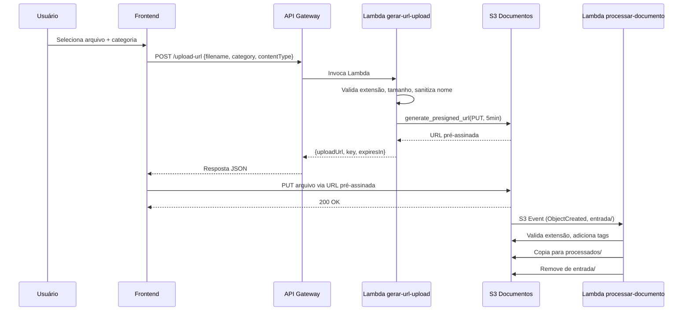

# 🔐 Cofre Digital de Arquivos com Amazon S3

## Descrição

O **Cofre Digital de Arquivos** é um sistema serverless para upload, gerenciamento, download, versionamento e arquivamento de documentos em um bucket S3 privado, utilizando URLs pré-assinadas para acesso seguro sem exposição de credenciais.

Toda a infraestrutura é criada **manualmente via Console AWS** — sem Terraform, CloudFormation, CDK ou SAM. O guia de implantação orienta cada configuração campo a campo.


.png)
---

## 🎯 Funcionalidades

- Criação e configuração de buckets privados
- Upload e download via URLs pré-assinadas (pre-signed URLs)
- Versionamento de objetos
- Classes de armazenamento (Standard, Intelligent-Tiering, Glacier, Deep Archive)
- Regras de ciclo de vida (Lifecycle Rules)
- Notificações de eventos S3
- Integração com Lambda, API Gateway e CloudFront
- Políticas IAM de privilégio mínimo
- Segurança: OAC, HTTPS enforçado, criptografia SSE-S3

---

## 🏗️ Arquitetura

.png)

---

## 📤 Fluxo Completo de Upload

O upload de documentos segue um fluxo seguro que nunca expõe credenciais AWS ao navegador:



**Etapas detalhadas:**

1. O usuário seleciona um arquivo e uma categoria (contratos, notas-fiscais, relatórios, comprovantes, outros)
2. O frontend solicita uma URL pré-assinada ao backend via API Gateway

.png)
.png)


3. O Lambda valida a extensão (pdf, png, jpg, jpeg, csv, xlsx, txt), tamanho (máx. 20MB) e sanitiza o nome do arquivo

.png)

4. O S3 gera uma URL temporária (5 minutos) para upload direto
5. O frontend envia o arquivo diretamente ao S3 usando a URL pré-assinada (PUT)
6. O S3 dispara uma notificação de evento (ObjectCreated) para o Lambda de processamento
7. O Lambda de processamento valida, adiciona tags e move o documento para o prefixo `processados/`

.png)

---

## ☁️ Serviços AWS Utilizados

| Serviço | Função no Projeto |
|---------|-------------------|
| **Amazon S3** | Armazenamento de documentos e hospedagem do frontend estático |
| **Amazon CloudFront** | CDN para servir o frontend com HTTPS e OAC |
| **Amazon API Gateway** | API HTTP que roteia requisições para as funções Lambda |
| **AWS Lambda** | Funções serverless que implementam a lógica de negócio |
| **AWS IAM** | Controle de acesso com políticas de privilégio mínimo |
| **Amazon CloudWatch** | Logs e monitoramento das funções Lambda |

.png)

.png)

---

## 🗄️ Classes de Armazenamento S3

O projeto utiliza diferentes classes de armazenamento com transição automática via Lifecycle Rules:

| Classe | Uso | Disponibilidade | Recuperação |
|--------|-----|-----------------|-------------|
| **S3 Standard** | Documentos recém-enviados, acesso frequente | 99,99% | Imediata (milissegundos) |
| **S3 Intelligent-Tiering** | Documentos com padrão de acesso variável (após 30 dias) | 99,9% | Imediata (milissegundos) |
| **S3 Glacier Flexible Retrieval** | Arquivamento de longo prazo (após 180 dias) | 99,99% | Minutos a horas (conforme tier) |
| **S3 Glacier Deep Archive** | Arquivamento raramente acessado (após 365 dias) | 99,99% | Até 12 horas |

.png)

---

## 📋 Versionamento

O bucket de documentos possui **versionamento habilitado**, o que significa:

- Cada upload de um arquivo com o mesmo nome cria uma **nova versão** (não sobrescreve)
- Versões anteriores ficam acessíveis pelo `VersionId`
- É possível listar todas as versões de um documento e baixar qualquer uma delas
- Delete markers permitem "excluir" sem perder versões anteriores
- Versões não-correntes são limpas automaticamente pelas regras de ciclo de vida (após 90 dias)

---

## ♻️ Regras de Ciclo de Vida (Lifecycle Rules)

O projeto configura três regras de ciclo de vida para automação de custos:

### Regra 1: Arquivar documentos processados
- **Prefixo:** `processados/`
- Standard → Intelligent-Tiering após **30 dias**
- Intelligent-Tiering → Glacier Flexible Retrieval após **180 dias**
- Glacier Flexible → Deep Archive após **365 dias**
- Expiração (exclusão) após **730 dias** (2 anos)

### Regra 2: Expirar arquivos temporários
- **Prefixo:** `temporarios/`
- Versão corrente expira após **7 dias**
- Versões não-correntes expiram após **7 dias**
- Uploads multipart incompletos abortados após **1 dia**

### Regra 3: Limpar versões antigas
- **Prefixo:** `processados/`
- Versões não-correntes removidas após **90 dias**
- Marcadores de exclusão expirados são limpos automaticamente

---

## 🔗 URLs Pré-Assinadas (Pre-Signed URLs)

URLs pré-assinadas são o mecanismo central de segurança do projeto:

- **O que são:** URLs temporárias que concedem permissão específica (PUT ou GET) a um objeto S3 por tempo limitado
- **Por que usar:** O bucket é 100% privado — sem URLs pré-assinadas, ninguém consegue fazer upload ou download
- **Validade:** 5 minutos (configurável via variável de ambiente)
- **Segurança:** A URL carrega a assinatura da credencial que a gerou. Após expiração, torna-se inválida
- **Upload (PUT):** Gerada pelo Lambda `gerar-url-upload` — permite enviar um arquivo específico ao prefixo `entrada/`
- **Download (GET):** Gerada pelo Lambda `gerar-url-download` — permite baixar um arquivo específico de `processados/`

O frontend **nunca** possui credenciais AWS. Toda operação com S3 passa por URLs pré-assinadas geradas pelo backend.

---

## 📁 Estrutura do Repositório

```
cofre-digital-arquivos/
├── frontend/                    # Frontend estático (HTML/CSS/JS puro)
│   ├── index.html              # Página principal
│   ├── styles.css              # Estilos responsivos
│   ├── app.js                  # Lógica de interação com API
│   └── config.js              # URL base da API (configurável)
├── lambdas/                    # Funções Lambda (Python 3.12)
│   ├── gerar_url_upload/       # Gera URL pré-assinada para upload
│   ├── processar_documento/    # Processa documentos via S3 Event
│   ├── listar_documentos/      # Lista documentos processados
│   ├── gerar_url_download/     # Gera URL pré-assinada para download
│   ├── listar_versoes/         # Lista versões de um documento
│   ├── restaurar_documento/    # Restaura objetos Glacier
│   └── shared/                 # Módulos compartilhados (validação, keys, response)
├── iam/                        # Políticas IAM para cada Lambda
│   ├── trust-policy-lambda.json
│   ├── gerar-url-upload-policy.json
│   ├── processar-documento-policy.json
│   ├── listar-documentos-policy.json
│   ├── gerar-url-download-policy.json
│   ├── listar-versoes-policy.json
│   └── restaurar-documento-policy.json
├── s3/                         # Configurações do bucket S3
│   ├── bucket-policy-documentos.json
│   ├── bucket-policy-frontend.json
│   ├── cors-documentos.json
│   ├── lifecycle-processados.json
│   ├── lifecycle-temporarios.json
│   └── lifecycle-versoes.json
├── tests/
│   └── events/                 # Exemplos de eventos (API Gateway, S3)
├── images/                     # Capturas de tela da implantação
├── README.md                   # Este arquivo
├── ARQUITETURA.md              # Diagramas e decisões arquiteturais
├── IMPLANTACAO.md              # Passo a passo via Console AWS
└── LICENSE
```

---

## ✅ Pré-requisitos

- **Conta AWS** ativa
- **Conhecimento básico de AWS:** saber navegar no Console, entender conceitos de IAM e S3
- **Navegador moderno** com suporte a JavaScript ES6+
- **Editor de texto** para editar arquivos de configuração (config.js, políticas JSON)

---

## 📖 Documentação Complementar

| Documento | Descrição |
|-----------|-----------|
| [IMPLANTACAO.md](./IMPLANTACAO.md) | Passo a passo completo de implantação via Console AWS |
| [ARQUITETURA.md](./ARQUITETURA.md) | Diagramas Mermaid e explicação de componentes |

---

## 🛠️ Tecnologias e Abordagem

- **Infraestrutura:** Criada 100% via Console AWS (sem IaC)
- **Backend:** Python 3.12 com boto3 (AWS SDK)
- **Frontend:** HTML, CSS e JavaScript puros (sem frameworks)
- **Documentação:** Markdown com diagramas Mermaid
